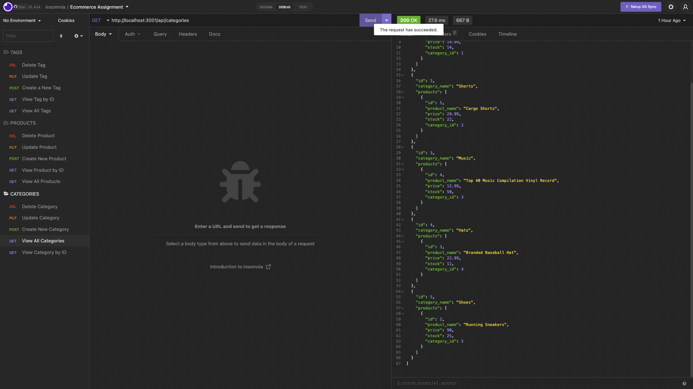

# E-Commerce

## Description

This application serves as the back end functionality for an e-commerce site where you can view, add, udpdate, and delete different categories, products, and tags.

## Table of Contents

- [Installation](#installation)
- [Usage](#usage)
- [Credits](#credits)
- [License](#license)

## Installation

- dotenv npm package
- MySQL2 npm package
- Sequelize npm package

## Usage

To use this this application, you must first consult the installation section of this README and install the three requirements.  You must "source schema.sql" and "use ecommerce_db" using the your MySQL database. Then, in your terminal type "npm run seed" to add seed data to the database. To start the server, type "npm start" in your terminal. Then, you can use Insomnia to test the get, post, put, and delete requests using the categories, products, and tags routes at "http://localhost:3001/api".

## Credits

Starter code provided by:\
 Xandromus at https://github.com/Xandromus\
 GitHub repository: https://github.com/coding-boot-camp/fantastic-umbrella

## License

N/A